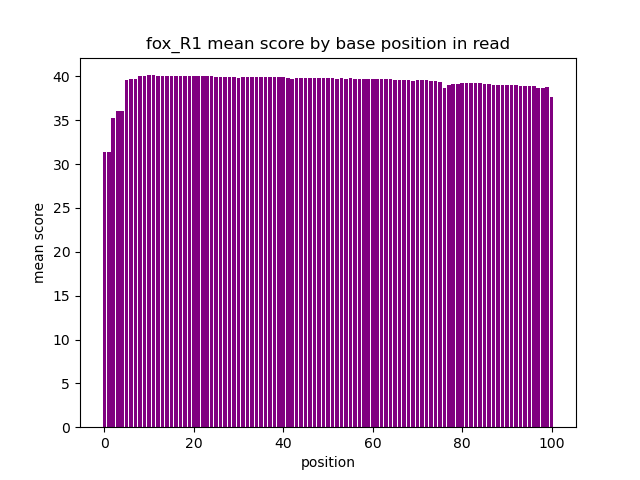
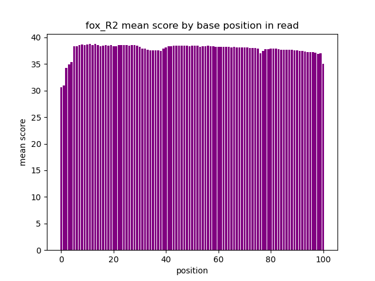
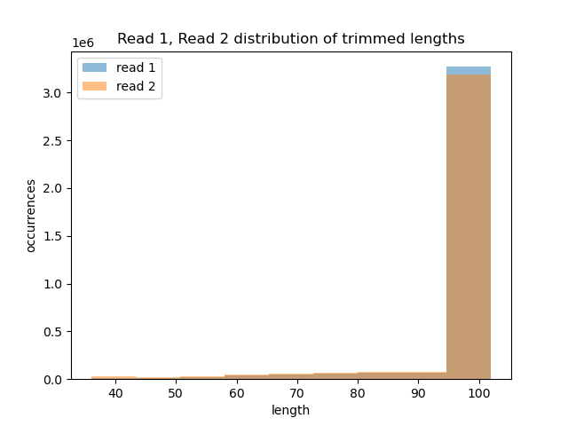

```{r setup, include=FALSE}
knitr::opts_chunk$set(echo = TRUE)
```

# Part 1 - Read quality score distributions

### 1. 

```
# load fastqc module
module load fastqc/0.11.5

# run fastqc
fastqc /projects/bgmp/shared/2017_sequencing/demultiplexed/31_4F_fox_S22_L008_R1_001.fastq.gz \
  /projects/bgmp/shared/2017_sequencing/demultiplexed/31_4F_fox_S22_L008_R2_001.fastq.gz \
  -t 6 \
  -o fox
fastqc /projects/bgmp/shared/2017_sequencing/demultiplexed/23_4A_control_S17_L008_R1_001.fastq.gz \
  /projects/bgmp/shared/2017_sequencing/demultiplexed/23_4A_control_S17_L008_R2_001.fastq.gz \
  -o control \
  -t 8


# move html output here
scp jadler2@talapas-ln1.uoregon.edu:/projects/bgmp/jadler2/bioinfo/Bi623/QAA/fox/*.html .
scp jadler2@talapas-ln1.uoregon.edu:/projects/bgmp/jadler2/bioinfo/Bi623/QAA/control/*.html .
```

### 2. 

```
# run histogram generator from demultiplex assignment-the-first
sbatch --output=fox_R1_histogram.out \
  --time=10:00:00 \
  /projects/bgmp/jadler2/bioinfo/Bi622/Demultiplex/Assignment-the-first/histogram_generator.srun \
  /projects/bgmp/shared/2017_sequencing/demultiplexed/31_4F_fox_S22_L008_R1_001.fastq.gz \
  101 \
  3788343 \
  31_4F_fox_S22_L008_R1_001.histogram.png \
  fox_R1
```

  
```
sbatch --output=fox_R2_histogram.out \
  --time=10:00:00 /projects/bgmp/jadler2/bioinfo/Bi622/Demultiplex/Assignment-the-first/histogram_generator.srun \
  /projects/bgmp/shared/2017_sequencing/demultiplexed/31_4F_fox_S22_L008_R2_001.fastq.gz \
  101 \
  3788343 \
  31_4F_fox_S22_L008_R2_001.histogram.png \
  fox_R2

```


Yes, the output and runtimes do differ. The fastqc graphs include box and whiskers to demonstrate the range of values found at each base. The fastqc charts also include green (28-41), yellow (20-28), and red (0-20) areas that correspond to quality level. This is helpful in providing the viewer with a quick reference of quality level at each base. 

#### Fox files
The histogram generator runs for the fox files each took about 3 minutes 45 seconds and only produced the one histogram. The fastqc runs can be run with multiple CPUs using the -t flag. Running the two files with -t 6 results in total runtime of 29 seconds and produces substantially more information relative to our histogram generator script.

#### Control files
The histogram generator runs for the control files each took about    Running fastqc on the two controls files with 8 CPUs result sin total runtime of 3 minutes 45 seconds and produces substantially more information relative to our histogram generator script.

### 3. 

#### Fox files
The quality of each of the read files is high. Neither was flagged for poor quality. The mean score is in the green for each of the read files. The 31_4F_fox_S22_L008_R2_001.fastq.gz file does have some whiskers that drop down into the 'yellow' zone (less than 28 mean quality score), but the mean and majority quality scores hover between 34-41.

#### Control files
The quality for each of the read files is high, though R2 does have quite a few whiskers extending into the yellow range and one whisker that extends into the red range. The mean quality score across all bases are all in the green, though the 1st base mean quality is around 30, the lowest mean quality score of any of the four files we processed.

# Part 2 - Adaptor trimming comparison

#### 4. 

```
# create new conda env
conda create --name QAA python=3.9
conda activate QAA

# install new packages
conda install cutadapt
conda install Trimmomatic

# check version
cutadapt = 3.4
Trimmomatic = 0.39

```

#### 5. 

```
/usr/bin/time -v cutadapt \
    -a AGATCGGAAGAGCACACGTCTGAACTCCAGTCA \
    -o trimmed_31_4F_fox_S22_L008_R1_001.fastq.gz \
    /projects/bgmp/shared/2017_sequencing/demultiplexed/31_4F_fox_S22_L008_R1_001.fastq.gz \
    -j 6

/usr/bin/time -v cutadapt \
    -a AGATCGGAAGAGCGTCGTGTAGGGAAAGAGTGT \
    -o trimmed_31_4F_fox_S22_L008_R2_001.fastq.gz \
    /projects/bgmp/shared/2017_sequencing/demultiplexed/31_4F_fox_S22_L008_R2_001.fastq.gz \
    -j 6
```

##### confirm adapter were removed

```
zcat trimmed_31_4F_fox_S22_L008_R1_001.fastq.gz | grep -e "AGATCGGAAGAGCACACGTCTGAACTCCAGTCA"

zcat trimmed_31_4F_fox_S22_L008_R2_001.fastq.gz | grep -e "AGATCGGAAGAGCGTCGTGTAGGGAAAGAGTGT"
```

* neither command returned anything, confirming that none of the reads present in each of those files contain the adapter sequence

#### 6. 

```
java -jar /projects/bgmp/jadler2/bioinfo/Bi623/QAA/Trimmomatic-0.39/trimmomatic-0.39.jar PE \
  -threads 8 \
  /projects/bgmp/jadler2/bioinfo/Bi623/QAA/trimmed_31_4F_fox_S22_L008_R1_001.fastq.gz \
  /projects/bgmp/jadler2/bioinfo/Bi623/QAA/trimmed_31_4F_fox_S22_L008_R2_001.fastq.gz \
  -baseout Trim_Reads/quality_trimmed_31_4F_fox_S22_L008_001.fastq.gz \
  LEADING:3 \
  TRAILING:3 \
  SLIDINGWINDOW:5:15 \
  MINLEN:35
```

#### 7.
```
./dual_histogram.py \
        -i1 Trim_Reads/quality_trimmed_31_4F_fox_S22_L008_001_1P.fastq.gz \
        -i2 Trim_Reads/quality_trimmed_31_4F_fox_S22_L008_001_2P.fastq.gz \
        -o trimmed_lengths.histogram.png \
        -t "Read 1, Read 2 distribution of trimmed lengths
```


# Part 3 - Alignment and strand-specificity

#### 8.

```
conda install star -c bioconda
conda install numpy
conda install pysam
conda install matplotlib
pip install HTSeq
```

#### 9.

```
# wget files
wget http://ftp.ensembl.org/pub/release-104/fasta/mus_musculus/dna/Mus_musculus.GRCm39.dna.primary_assembly.fa.gz
wget http://ftp.ensembl.org/pub/release-104/gtf/mus_musculus/Mus_musculus.GRCm39.104.gtf.gz

# generate mouse db
STAR --runThreadN 8 \
  --runMode genomeGenerate \
  --genomeDir /projects/bgmp/jadler2/bioinfo/Bi623/QAA/Mus_musculus.GRCm39.dna.ens.104.STAR_2.7.9a \
  --genomeFastaFiles /projects/bgmp/jadler2/bioinfo/Bi623/QAA/Mus_musculus.GRCm39.dna.primary_assembly.fa \
  --sjdbGTFfile /projects/bgmp/jadler2/bioinfo/Bi623/QAA/Mus_musculus.GRCm39.104.gtf

# align trimmed reads
STAR --runThreadN 8 \
  --runMode alignReads \
  --outFilterMultimapNmax 3 \
  --outSAMunmapped Within KeepPairs \
  --alignIntronMax 1000000 \
  --alignMatesGapMax 1000000 \
  --readFilesCommand zcat \
  --readFilesIn /projects/bgmp/jadler2/bioinfo/Bi623/QAA/Trim_Reads/quality_trimmed_31_4F_fox_S22_L008_001_1P.fastq.gz \
  /projects/bgmp/jadler2/bioinfo/Bi623/QAA/Trim_Reads/quality_trimmed_31_4F_fox_S22_L008_001_2P.fastq.gz \
  --genomeDir /projects/bgmp/jadler2/bioinfo/Bi623/QAA/Mus_musculus.GRCm39.dna.ens.104.STAR_2.7.9a \
  --outFileNamePrefix ./align/
```


#### 10.

```
# determine mapped vs unmapped 
/projects/bgmp/jadler2/bioinfo/Bi621/PS/ps8-adler-sudo/sam_filter.py -f /projects/bgmp/jadler2/bioinfo/Bi623/QAA/align/Aligned.out.sam \
  -o /projects/bgmp/jadler2/bioinfo/Bi623/QAA/map_v_unmap.txt"

```

#### 11.

