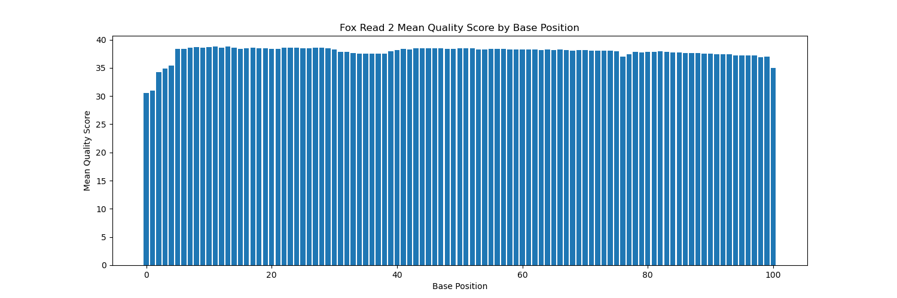
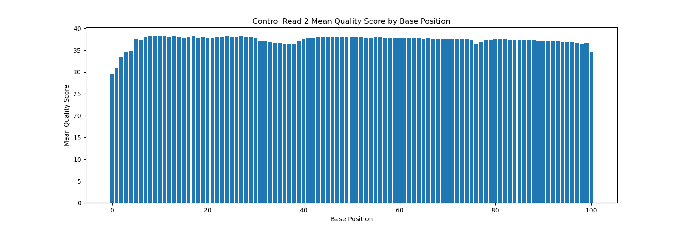
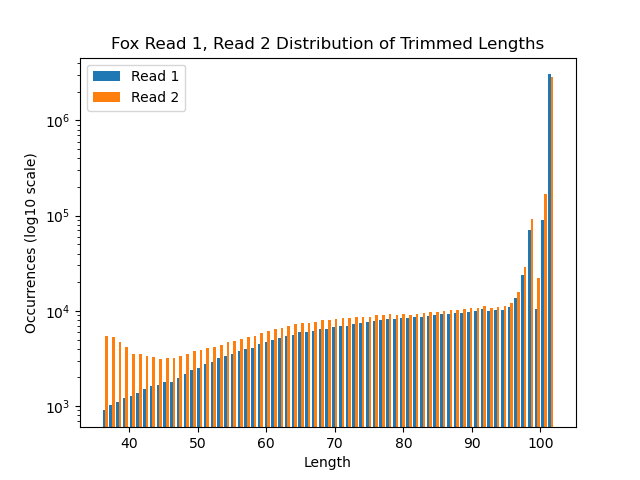
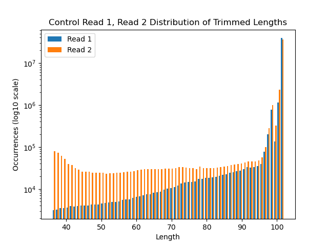

tidy.opts = list(width.cutoff = 40), tidy=TRUE


# Part 1 - Read quality score distributions


### Files - referred to as 'Fox' and 'Control' files throughout report

**Fox Files**

* /projects/bgmp/shared/2017_sequencing/demultiplexed/31_4F_fox_S22_L008_R1_001.fastq.gz

* /projects/bgmp/shared/2017_sequencing/demultiplexed/31_4F_fox_S22_L008_R2_001.fastq.gz


**Control Files**

* /projects/bgmp/shared/2017_sequencing/demultiplexed/23_4A_control_S17_L008_R1_001.fastq.gz

* /projects/bgmp/shared/2017_sequencing/demultiplexed/23_4A_control_S17_L008_R2_001.fastq.gz


## 1. Fastqc run

```
# load fastqc module
module load fastqc/0.11.5
```

\newpage

**Fastqc Command Fox Files:**

```
fastqc /projects/bgmp/shared/2017_sequencing/demultiplexed/31_4F_fox_S22_L008_R1_001.fastq.gz \
    /projects/bgmp/shared/2017_sequencing/demultiplexed/31_4F_fox_S22_L008_R2_001.fastq.gz \
    -o fox \
    -t 8
```

**Fox Read 1 Results:**


<br>


<br>

\newpage

**Fox Read 2 Results:**


<br>


<br>

\newpage

**Fastqc Command Control Files:**

```
fastqc /projects/bgmp/shared/2017_sequencing/demultiplexed/23_4A_control_S17_L008_R1_001.fastq.gz \
    /projects/bgmp/shared/2017_sequencing/demultiplexed/23_4A_control_S17_L008_R2_001.fastq.gz \
    -o control \
    -t 8
```

**Control Read 2 Results:**


<br>


<br>

\newpage

**Control Read 2 Results:**


<br>


<br>

The per-base N quality graphs are consistent with the per-base quality graphs in that base 1 has higher N content relative to the other bases. This is in alignment with the lower per-base quality score relative to the other bases.

\newpage

## 2. Histogram generator

**Fox Read 1:**

```
/projects/bgmp/jadler2/bioinfo/Bi623/QAA/python_scripts/histogram_generator.py \
  -f /projects/bgmp/shared/2017_sequencing/demultiplexed/31_4F_fox_S22_L008_R1_001.fastq.gz \
  -l 101 \
  -n 3788343 \
  -o images/31_4F_fox_S22_L008_R1_001.histogram.png \
  -t "Fox Read 1"
```


<br>

\newpage

**Fox Read 2:**

```
/projects/bgmp/jadler2/bioinfo/Bi623/QAA/python_scripts/histogram_generator.py \
  -f /projects/bgmp/shared/2017_sequencing/demultiplexed/31_4F_fox_S22_L008_R2_001.fastq.gz \
  -l 101 \
  -n 3788343 \
  -o images/31_4F_fox_S22_L008_R2_001.histogram.png \
  -t "Fox Read 2"

```


<br>

\newpage

**Control Read 1:**

```
/projects/bgmp/jadler2/bioinfo/Bi623/QAA/python_scripts/histogram_generator.py \
    -f /projects/bgmp/shared/2017_sequencing/demultiplexed/23_4A_control_S17_L008_R1_001.fastq.gz \
    -l 101 \
    -n 44303262 \
    -o images/23_4A_control_S17_L008_R1_001.histogram.png \
    -t "Control Read 1"
```


<br>

\newpage

**Control Read 2:**

```
/projects/bgmp/jadler2/bioinfo/Bi623/QAA/python_scripts/histogram_generator.py \
    -f /projects/bgmp/shared/2017_sequencing/demultiplexed/23_4A_control_S17_L008_R2_001.fastq.gz \
    -l 101 \
    -n 44303262 \
    -o images/23_4A_control_S17_L008_R2_001.histogram.png \
    -t "Control Read 2"
```



<br>

**Runtime difference:** Yes, the output and runtimes do differ. The fastqc graphs include box and whiskers to demonstrate the range of values found at each base. The fastqc charts also include green (28-41), yellow (20-28), and red (0-20) areas that correspond to quality level. This is helpful in providing the viewer with a quick reference of quality level at each base. 

**Fox files:** The histogram generator runs for the fox files each took about 3 minutes 45 seconds and only produced the one histogram. The fastqc runs can be run with multiple CPUs using the -t flag. Running the two files with -t 8 results in total runtime of 29 seconds and produces substantially more information relative to our histogram generator script.

**Control files:** The histogram generator runs for the control files each took about 40 minutes. Running fastqc on the two controls files with 8 CPUs result sin total runtime of 3 minutes 45 seconds and produces substantially more information relative to our histogram generator script.


## 3. Comment on the overall data quality of the two libraries

**Fox files:** The quality of each of the read files is high. Neither was flagged for poor quality. The mean score is in the green for each of the read files. The 31_4F_fox_S22_L008_R2_001.fastq.gz file does have some whiskers that drop down into the 'yellow' zone (less than 28 mean quality score), but the mean and majority quality scores hover between 34-41.

**Control files:** The quality for each of the read files is high, though R2 does have quite a few whiskers extending into the yellow range and one whisker that extends into the red range. The mean quality score across all bases are all in the green, though the 1st base mean quality is around 30, the lowest mean quality score of any of the four files we processed.

\newpage

# Part 2 - Adaptor trimming comparison


## 4. New conda env, install new packages

```
# create new conda env
conda create --name QAA python=3.9
conda activate QAA

# install new packages
conda install cutadapt
conda install Trimmomatic
```

### Version of cutadapt and Trimmomatic

* cutadapt = 3.4
* Trimmomatic = 0.39


## 5. Adapter trim with cutadapt

**Adapter Trim Fox Files:**

```
cutadapt -a AGATCGGAAGAGCACACGTCTGAACTCCAGTCA \
  -A AGATCGGAAGAGCGTCGTGTAGGGAAAGAGTGT \
  -o /projects/bgmp/jadler2/bioinfo/Bi623/QAA/trimmed_31_4F_fox_S22_L008_R1_001.fastq.gz \
  -p /projects/bgmp/jadler2/bioinfo/Bi623/QAA/trimmed_31_4F_fox_S22_L008_R2_001.fastq.gz \
  /projects/bgmp/shared/2017_sequencing/demultiplexed/31_4F_fox_S22_L008_R1_001.fastq.gz \
  /projects/bgmp/shared/2017_sequencing/demultiplexed/31_4F_fox_S22_L008_R2_001.fastq.gz
```

**Adapter Trim Control Files:**

```
cutadapt -a AGATCGGAAGAGCACACGTCTGAACTCCAGTCA \
  -A AGATCGGAAGAGCGTCGTGTAGGGAAAGAGTG \
  -o /projects/bgmp/jadler2/bioinfo/Bi623/QAA/trimmed_23_4A_control_S17_L008_R1_001.fastq.gz \
  -p /projects/bgmp/jadler2/bioinfo/Bi623/QAA/trimmed_23_4A_control_S17_L008_R2_001.fastq.gz \
  /projects/bgmp/shared/2017_sequencing/demultiplexed/23_4A_control_S17_L008_R1_001.fastq.gz \
  /projects/bgmp/shared/2017_sequencing/demultiplexed/23_4A_control_S17_L008_R2_001.fastq.gz
```

**Confirm adapter sequences were removed:**

```
zcat trimmed_31_4F_fox_S22_L008_R1_001.fastq.gz | grep "AGATCGGAAGAGCACACGTCTGAACTCCAGTCA"

zcat trimmed_31_4F_fox_S22_L008_R2_001.fastq.gz | grep "AGATCGGAAGAGCGTCGTGTAGGGAAAGAGTGT"

zcat trimmed_23_4A_control_S17_L008_R1_001.fastq.gz | grep "AGATCGGAAGAGCACACGTCTGAACTCCAGTCA"

zcat trimmed_23_4A_control_S17_L008_R2_001.fastq.gz | grep "AGATCGGAAGAGCGTCGTGTAGGGAAAGAGTGT"
```


**Results of adapter check:** All returns to the above commands returned nothing, confirming that adapter sequences are not present in the adapter-trimmed files.

**Reasoning for choosing commands for adapter check:** I chose to use these commands because I want to confirm that the adapter sequence was removed from the reads and the trimmed reads output to a new file.


**What proportion of reads were trimmed?**

<br>

**Fox File Adapter Trim Stats:**

Total read pairs processed:          3,788,343

  Read 1 with adapter:                 456,168 (12.0%)
  
  Read 2 with adapter:                 482,503 (12.7%)

<br>

**Control File Adapter Trim Stats:**

Total read pairs processed:         44,303,262

  Read 1 with adapter:               1,359,563 (3.1%)
  
  Read 2 with adapter:               1,657,295 (3.7%)
  
  
  


## 6. Trimmomatic runs

**Fox File Trimmomatic Command:**

```
java -jar /projects/bgmp/jadler2/bioinfo/Bi623/QAA/Trimmomatic-0.39/trimmomatic-0.39.jar PE \
  -threads 8 \
  /projects/bgmp/jadler2/bioinfo/Bi623/QAA/adapter_trimmed/trimmed_31_4F_fox_S22_L008_R1_001.fastq.gz \
  /projects/bgmp/jadler2/bioinfo/Bi623/QAA/adapter_trimmed/trimmed_31_4F_fox_S22_L008_R2_001.fastq.gz \
  -baseout /projects/bgmp/jadler2/bioinfo/Bi623/QAA/Trim_Reads/quality_trimmed_31_4F_fox_S22_L008_001.fastq.gz \
  LEADING:3 \
  TRAILING:3 \
  SLIDINGWINDOW:5:15 \
  MINLEN:35
```


**Control File Trimmomatic Command:**

```{tidy=TRUE, tidy.opts=list(width.cutoff=60)}
java -jar /projects/bgmp/jadler2/bioinfo/Bi623/QAA/Trimmomatic-0.39/trimmomatic-0.39.jar PE \
  -threads 8 \
  /projects/bgmp/jadler2/bioinfo/Bi623/QAA/adapter_trimmed/trimmed_23_4A_control_S17_L008_R1_001.fastq.gz \
  /projects/bgmp/jadler2/bioinfo/Bi623/QAA/adapter_tirmmed/trimmed_23_4A_control_S17_L008_R2_001.fastq.gz \
  -baseout /projects/bgmp/jadler2/bioinfo/Bi623/QAA/Trim_Reads/quality_trimmed_23_4A_control_S17_L008_R1_001.fastq.gz \
  LEADING:3 \
  TRAILING:3 \
  SLIDINGWINDOW:5:15 \
  MINLEN:35
```


## 7. Distribution of length of trimmed sequences in each read for each group

\newpage

```
./python_scripts/dual_histogram.py \
  -i1 /projects/bgmp/jadler2/bioinfo/Bi623/QAA/Trim_Reads/quality_trimmed_31_4F_fox_S22_L008_001_1P.fastq.gz \
  -n1 3597908 \
  -i2 /projects/bgmp/jadler2/bioinfo/Bi623/QAA/Trim_Reads/quality_trimmed_31_4F_fox_S22_L008_001_2P.fastq.gz \
  -n2 3597908 \
  -o images/trimmed_lengths_fox.histogram.png \
  -t "Fox Read 1, Read 2 Distribution of Trimmed Lengths"
```



<br>

\newpage

```
./python_scripts/dual_histogram.py \
  -i1 /projects/bgmp/jadler2/bioinfo/Bi623/QAA/Trim_Reads/quality_trimmed_23_4A_control_S17_L008_R1_001_1P.fastq.gz \
  -n1 42056563 \
  -i2 /projects/bgmp/jadler2/bioinfo/Bi623/QAA/Trim_Reads/quality_trimmed_23_4A_control_S17_L008_R1_001_2P.fastq.gz \
  -n2 42056563 \
  -o images/trimmed_lengths_control.histogram.png \
  -t "Control Read 1, Read 2 Distribution of Trimmed Lengths"
```



<br>

**R1 or R2 adapter-trimmed at different rates?** I would expect R2 to be adapter-trimmed at a higher rate. Because this read sits on the sequencer for a longer period of time, the strand is exposed to a greater amount of harsh chemicals and there are more opportunities for errors to be made, including erroneous adapter binding.

\newpage

# Part 3 - Alignment and strand-specificity

## 8. Install new packages

```
conda install star -c bioconda
conda install numpy
conda install pysam
conda install matplotlib
pip install HTSeq
```


## 9. STAR mouse database creation and mapping

```
# wget files
wget http://ftp.ensembl.org/pub/release-104/fasta/mus_musculus/dna/Mus_musculus.GRCm39.dna.primary_assembly.fa.gz
wget http://ftp.ensembl.org/pub/release-104/gtf/mus_musculus/Mus_musculus.GRCm39.104.gtf.gz

# generate mouse db
STAR --runThreadN 8
  --runMode genomeGenerate
  --genomeDir /projects/bgmp/jadler2/bioinfo/Bi623/QAA/Mus_musculus.GRCm39.dna.ens.104.STAR_2.7.9a
  --genomeFastaFiles /projects/bgmp/jadler2/bioinfo/Bi623/QAA/Mus_musculus.GRCm39.dna.primary_assembly.fa
  --sjdbGTFfile /projects/bgmp/jadler2/bioinfo/Bi623/QAA/Mus_musculus.GRCm39.104.gtf
```

**Align Quality Trimmed Fox Reads:**

```
STAR --runThreadN 8 \
  --runMode alignReads \
  --outFilterMultimapNmax 3 \
  --outSAMunmapped Within KeepPairs \
  --alignIntronMax 1000000 \
  --alignMatesGapMax 1000000 \
  --readFilesCommand zcat \
  --readFilesIn /projects/bgmp/jadler2/bioinfo/Bi623/QAA/Trim_Reads/quality_trimmed_31_4F_fox_S22_L008_001_1P.fastq.gz \
  /projects/bgmp/jadler2/bioinfo/Bi623/QAA/Trim_Reads/quality_trimmed_31_4F_fox_S22_L008_001_2P.fastq.gz \
  --genomeDir /projects/bgmp/jadler2/bioinfo/Bi623/QAA/Mus_musculus.GRCm39.dna.ens.104.STAR_2.7.9a \
  --outFileNamePrefix ./align/fox/
```

**Align Quality Trimmed Control Reads:**

```
STAR --runThreadN 8 \
  --runMode alignReads \
  --outFilterMultimapNmax 3 \
  --outSAMunmapped Within KeepPairs \
  --alignIntronMax 1000000 \
  --alignMatesGapMax 1000000 \
  --readFilesCommand zcat \
  --readFilesIn /projects/bgmp/jadler2/bioinfo/Bi623/QAA/Trim_Reads/quality_trimmed_23_4A_control_S17_L008_R1_001_1P.fastq.gz \
  /projects/bgmp/jadler2/bioinfo/Bi623/QAA/Trim_Reads/quality_trimmed_23_4A_control_S17_L008_R1_001_2P.fastq.gz \
  --genomeDir //projects/bgmp/jadler2/bioinfo/Bi623/QAA/Mus_musculus.GRCm39.dna.ens.104.STAR_2.7.9a \
  --outFileNamePrefix ./align/control/
```


## 10. Mapped vs. unmapped reads

**Mapped vs. Unmapped Fox .sam:**

```
# determine mapped vs unmapped 
/projects/bgmp/jadler2/bioinfo/Bi623/QAA/python_scripts/sam_filter.py \
  -f /projects/bgmp/jadler2/bioinfo/Bi623/QAA/align/fox/Aligned.out.sam \
  -o /projects/bgmp/jadler2/bioinfo/Bi623/QAA/mapping_summaries/map_v_unmap_fox.txt"

```

file: /projects/bgmp/jadler2/bioinfo/Bi623/QAA/align/fox/Aligned.out.sam

mapped reads: 6969878

unmapped reads: 225938


**Mapped vs. Unmapped Control .sam:**

```
/projects/bgmp/jadler2/bioinfo/Bi623/QAA/python_scripts/sam_filter.py \
  -f /projects/bgmp/jadler2/bioinfo/Bi623/QAA/align/control/Aligned.out.sam \
  -o /projects/bgmp/jadler2/bioinfo/Bi623/QAA/mapping_summaries/map_v_unmap_control.txt
```

**file:** /projects/bgmp/jadler2/bioinfo/Bi623/QAA/align/control/Aligned.out.sam

**mapped reads:** 79473045

**unmapped reads:** 4640081


## 11. Count reads that map to features using htseq-count

**Stranded htseq-count Fox Files:**

```
htseq-count -q \
  -f sam \
  -s yes \
  /projects/bgmp/jadler2/bioinfo/Bi623/QAA/align/fox/Aligned.out.sam \
  /projects/bgmp/jadler2/bioinfo/Bi623/QAA/Mus_musculus.GRCm39.104.gtf
```

**Stranded htseq-count Control Files:**

```
htseq-count -q \
  -f sam \
  -s yes \
  /projects/bgmp/jadler2/bioinfo/Bi623/QAA/align/control/Aligned.out.sam \
  /projects/bgmp/jadler2/bioinfo/Bi623/QAA/Mus_musculus.GRCm39.104.gtf
```

**Untranded htseq-count Fox Files:**

```
htseq-count -q \
  -f sam \
  -s no \
  /projects/bgmp/jadler2/bioinfo/Bi623/QAA/align/fox/Aligned.out.sam \
  /projects/bgmp/jadler2/bioinfo/Bi623/QAA/Mus_musculus.GRCm39.104.gtf
```

**Untranded htseq-count Control Files:**

```
htseq-count -q \
  -f sam \
  -s no \
  /projects/bgmp/jadler2/bioinfo/Bi623/QAA/align/control/Aligned.out.sam \
  /projects/bgmp/jadler2/bioinfo/Bi623/QAA/Mus_musculus.GRCm39.104.gtf
```


## 12. Demonstrate whether data are strand-specific RNA-seq libraries or not

**Determine number of mapped reads in each file:**

```
for f in $(ls); do echo $f; grep -v '^_' $f | awk '{sum+=$2} END {print sum}'; done

control_stranded.genecount
1516759

control_unstranded.genecount
31747007

fox_stranded.genecount
180499

fox_unstranded.genecount
2922418
```

<br>

**Determine total reads in each file:**

```
for f in $(ls); do echo $f; cat $f | awk '{sum+=$2} END {print sum}'; done

control_stranded.genecount
42056563

control_unstranded.genecount
42056563

fox_stranded.genecount
3597908

fox_unstranded.genecount
3597908
```

<br>

**Determine percentage of reads mapped:**

```
control_stranded.genecount
1516759 / 42056563 = 3.6%

control_unstranded.genecount
31747007 / 42056563 = 75.0%

fox_stranded.genecount
180499 / 3597908 = 5.0%

fox_unstranded.genecount
2922418 / 3597908 = 81.0%
```

<br>

**Stranded or unstranded library prep:** I propose the data are from unstranded library preps because only 3.6% and 5.0% of the stranded control and fox reads, respectively, map to the mouse genome, whereas, 75.0% and 81.0% of the unstranded control and fox reads, respectively, map to the mouse genome. 
